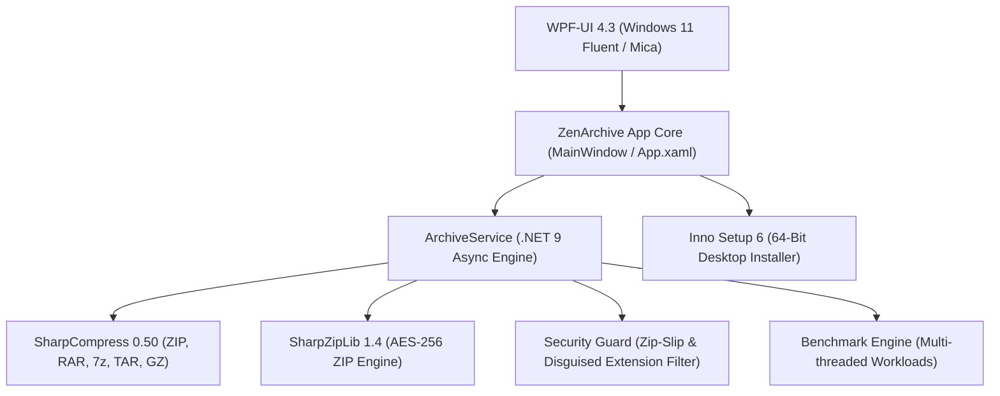

<div align="center">


# ZenArchive

### The Modern, Fluent Alternative to WinRAR & 7-Zip
**Next-Generation Archive Manager built for Windows 11 with .NET 9, Mica Glassmorphism & Enterprise Security.**

[](https://dotnet.microsoft.com/)
[](https://github.com/lepoco/wpfui)
[](#-enterprise-security--defense-features)
[](#-installer--deployment)
[](https://github.com/zenarchive/zenarchive/releases)
[](LICENSE)

---

</div>

## 🌟 Why ZenArchive?

For decades, archive management on Windows has been trapped in 1998: clunky dialogs, confusing nag screens, unsafe extractions that litter loose files across your Desktop, and vulnerability to path traversal exploits.

**ZenArchive** reimagines archiving from the ground up:
- 🎨 **Breathtaking Visuals**: Native Windows 11 Mica backdrop, dark Fluent theme, and silky micro-animations powered by `WPF-UI`.
- 🧠 **Smart Extract**: Automatically prevents desktop clutter by inspecting archives before extraction. If multiple loose files exist, it wraps them into a clean container folder. If contents are already in a single folder, it extracts directly without nesting redundant folders.
- 👁️ **In-Archive Quick Look**: Preview high-resolution images, inspect formatted text/code with syntax styling, and calculate instant SHA-256 hashes—all directly in memory without unpacking to disk.
- 🛡️ **Zero-Day Security Guard**: Active Zip-Slip sanitization neutralizes directory traversal exploits (`../../`), while the disguised extension shield immediately flags social engineering malware like `invoice.pdf.exe`.
- 🔐 **Military-Grade Encryption**: AES-256 password protection for modern `.zip` and `.7z` formats with a real-time password strength meter.
- ⚡ **Batch Processing & Benchmarking**: Multi-archive extraction/conversion queue with dual-progress visualization and an in-memory multi-threaded compression benchmark with dynamic **ZenScore** hardware ratings.

---

## ⚔️ ZenArchive vs. Legacy Archivers

| Feature | **ZenArchive v1.3** | **WinRAR** | **7-Zip** | **PeaZip** |
| :--- | :---: | :---: | :---: | :---: |
| **User Interface** | Modern Windows 11 Fluent / Mica | 1995 Win32 Grid | Minimalist Win32 List | Custom Lazarus Widget |
| **Desktop Clutter Prevention (Smart Extract)** | ✅ **Automatic** | ❌ Manual | ❌ Manual | ⚠️ Semi-manual |
| **In-Memory Image & Code Previews** | ✅ **Direct Stream** | ❌ Spawns Temp File | ❌ Spawns Temp File | ⚠️ Basic |
| **Executable Threat Shield (No Auto-Run)** | ✅ **Yes + SHA-256** | ❌ Double-click runs EXE | ❌ Double-click runs EXE | ❌ No |
| **Disguised Double-Extension Blocker** | ✅ **Active Warning Badge** | ❌ Hidden by OS | ❌ Hidden by OS | ❌ No |
| **Zip-Slip Path Traversal Neutralization** | ✅ **Strict Boundary Sandbox** | ⚠️ CVE-vulnerable in past | ⚠️ Varies | ⚠️ Varies |
| **Multi-Archive Batch Processing Queue** | ✅ **Smart Extract & Convert** | ⚠️ Complex wizard | ❌ No | ⚠️ Clunky |
| **Hardware Benchmark Engine** | ✅ **ZenScore Multithreaded** | ⚠️ Basic KB/s | ⚠️ Legacy MIPS | ❌ No |
| **Adware / License Nag Screen** | 🚫 **100% Free & Open** | ❌ "Buy WinRAR" popups | 🚫 Free | 🚫 Free |

---

## 🚀 Key Feature Highlights

### 1. 🧠 Smart Extract (Clutter-Free Extraction)
Tired of extracting an archive and having 50 loose files scattered across your Desktop or Downloads folder?
- **Loose File Detection**: ZenArchive analyzes root items inside the archive. If multiple loose files or multiple folders exist, ZenArchive creates a dedicated subfolder named after the archive.
- **Single Root Folder Preservation**: If the archive is already neatly packaged inside a single root directory, ZenArchive extracts it directly without creating annoying duplicate nested folders (`Folder/Folder/file.txt`).

### 2. 👁️ In-Archive Quick Look Preview & Inspector
Click any entry in the archive to open the responsive Inspector panel:
- **Images**: Instant high-DPI rendering for `.png`, `.jpg`, `.jpeg`, `.bmp`, `.webp`, and `.ico`.
- **Text & Code**: Formatted read-only code viewer for `.txt`, `.json`, `.xml`, `.cs`, `.py`, `.md`, `.log`, `.csv`, `.sql` with smooth line wrapping.
- **Safety Shield for Binaries**: If you click on an executable or script (`.exe`, `.bat`, `.dll`, `.ps1`, `.msi`), preview execution is locked down and a security warning shield appears alongside an instant in-memory **SHA-256 hash** for virus verification.

### 3. 🛡️ Enterprise Security & Defense Features
- **Zip-Slip Neutralization (`SanitizeEntryDestinationPath`)**: Neutralizes path traversal attacks (`../../evil.exe`, `C:\Windows\System32\...`, `/etc/passwd`). Unsafe relative paths are stripped and strictly confined within the target extraction root.
- **Disguised Double-Extension Detection**: Flags social engineering attacks such as `invoice_2026.pdf.exe` or `family_photo.jpg.scr` with a high-contrast warning badge and status pills.
- **Integrity & Health Audit ("Test Archive")**: Decompresses every entry in-memory, verifies internal header structures, checks CRC checksums, and renders a diagnostic health report.

### 4. 🔐 AES-256 Password Encryption & Creation Modal
- Compress files into modern `.zip` or high-efficiency `.7z`.
- Choose between **Store**, **Fast**, **Normal**, or **Maximum (LZMA)** compression levels.
- Protect confidential files with **AES-256 bit encryption**.
- Live **Password Strength Meter** provides immediate feedback on entropy and complexity.
- Support for encrypted filenames in `.7z` format.

### 5. 📦 Batch Processing Queue
- Drag and drop 2 or more archives simultaneously into the window to summon the **Batch Queue**.
- Perform **Smart Extract All**, **Convert All to ZIP**, or **Convert All to 7-Zip**.
- Dual-progress bars display overall queue progress and individual archive compression/extraction speed.

### 6. ⏱️ Hardware Compression Benchmark
- In-memory synthetic stress workload utilizing all CPU logical cores.
- Tests multi-threaded compression throughput and decompression throughput in MB/s.
- Awards an official **ZenScore** rating:
  - *Budget / Everyday PC*
  - *Mainstream Multitasker*
  - *High-Performance Rig*
  - *Enthusiast Workstation*
  - *Extreme Workstation 🚀*

---

## 💻 Command-Line Interface (CLI)

ZenArchive is engineered for seamless shell integration, automation, and script execution:

| Command | Description |
| :--- | :--- |
| `ZenArchive.exe "C:\Path\To\file.zip"` | Launches ZenArchive and immediately opens/inspects the specified archive. |
| `ZenArchive.exe -extract-here "C:\Path\To\file.zip"` | Extracts archive contents directly into the archive's parent folder. |
| `ZenArchive.exe -smart-extract "C:\Path\To\file.zip"` | Extracts the archive using clutter-free Smart Extract logic (auto-creates subfolder if loose files exist). |
| `ZenArchive.exe -compress "C:\Path\To\Files"` | Opens the Create Archive modal pre-populated with the specified source files/folders. |

---

## 🏗️ Architecture & Technology Stack

ZenArchive is constructed on the modern Microsoft .NET 9 desktop application stack:



- **Framework**: .NET 9.0 (`net9.0-windows`)
- **UI & Design System**: [WPF-UI](https://github.com/lepoco/wpfui) (Fluent Design System, Windows 11 Mica backdrop, modern controls)
- **Extraction & Archive Parsing**: [SharpCompress](https://github.com/adamhathcock/sharpcompress) (high-performance async streaming for `.zip`, `.rar`, `.7z`, `.tar`, `.gz`)
- **AES-256 ZIP Engine**: [SharpZipLib](https://github.com/icsharpcode/SharpZipLib) (native AES-256 encryption compliant with WinZip/7-Zip specifications)
- **Installer**: [Inno Setup 6](https://jrsoftware.org/isinfo.php) (modern 64-bit installer with registry file associations and explorer context menus)

---

## 📦 Installation & Deployment

### Recommended: Inno Setup Installer (`.exe`)
Download and run the official installer:
👉 **`ZenArchive_Setup_v1.3.exe`** (found in `bin/installer/`)

Features included with the installer:
- Automatic 64-bit program installation to `C:\Program Files\ZenArchive`
- File associations for `.zip`, `.7z`, `.rar`, `.tar`, and `.gz`
- Windows Explorer right-click context menu options:
  - **ZenArchive > Open with ZenArchive**
  - **ZenArchive > Extract Here**
  - **ZenArchive > Extract to \<ArchiveName>\** (Smart Extract)
  - **Add to ZenArchive...** (for any files & folders)
- Start Menu and Desktop shortcuts
- Clean Control Panel Uninstaller

### Building from Source

**Prerequisites**:
- [.NET 9.0 SDK](https://dotnet.microsoft.com/download/dotnet/9.0) (or higher)
- Windows 10 (1809+) or Windows 11 (64-bit)
- Optional: [Inno Setup 6](https://jrsoftware.org/isdl.php) (to compile the installer)

**Clone & Build**:
```powershell
# Clone repository
git clone https://github.com/zenarchive/zenarchive.git
cd zenarchive

# Build in Release configuration
dotnet build "Archieve App/Archieve App.csproj" -c Release

# Run ZenArchive
dotnet run --project "Archieve App/Archieve App.csproj"
```

**Build Self-Contained Installer**:
```powershell
# Run automated packaging script
powershell -ExecutionPolicy Bypass -File "Archieve App/installer/build_installer.ps1"
```
The resulting installer will be located at:
`Archieve App/bin/installer/ZenArchive_Setup_v1.3.exe`

---

## ⌨️ Keyboard Shortcuts & Gestures

| Shortcut / Action | Function |
| :--- | :--- |
| `Ctrl + O` / Toolbar Open | Browse and inspect an archive file |
| `Ctrl + N` / Toolbar New | Open the Create Archive modal |
| `Drag & Drop (1 archive)` | Instantly open and inspect the archive |
| `Drag & Drop (multiple archives)` | Summon the Batch Processing Queue |
| `Drag & Drop (uncompressed files)` | Open Create Archive modal with files pre-selected |
| `Search Box (Filter)` | Real-time instant search by filename, extension, or path |
| `Click on DataGrid row` | Expand the Quick Look Safety Preview / Inspector pane |
| `Esc` | Close any active modal dialog (Audit, Benchmark, Batch Queue, New Archive) |

---

## 📄 License & Attribution

ZenArchive is open-source software licensed under the **MIT License**.

- Built with ❤️ using [.NET 9](https://dotnet.microsoft.com/)
- UI powered by [WPF-UI](https://github.com/lepoco/wpfui) by Lepoco
- Compression powered by [SharpCompress](https://github.com/adamhathcock/sharpcompress) and [SharpZipLib](https://github.com/icsharpcode/SharpZipLib)
- Packaging powered by [Inno Setup 6](https://jrsoftware.org/isinfo.php)
