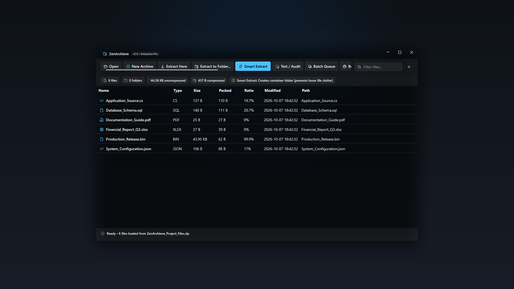
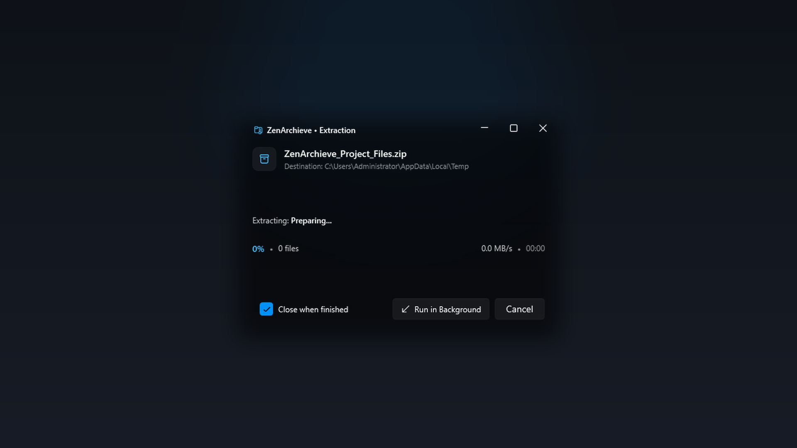
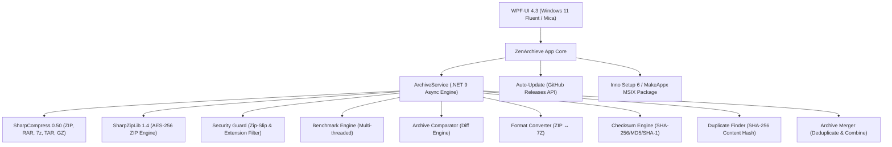

<div align="center">


# ZenArchieve

### 🏆 The Modern, High-Performance Archiver for Windows 11 & 10

**A next-generation, open-source archive manager crafted with .NET 9, native Windows 11 Mica Fluent styling, AES-256 encryption, and intelligent features that WinRAR and 7-Zip never had.**

<br/>

<!-- Store Download Buttons with Official Logos -->
<p align="center">
  <a href="https://apps.microsoft.com/detail/9n4hcx0krfnp?hl=en-US&gl=US" target="_blank" rel="noopener noreferrer">
    
  </a>
  &nbsp;&nbsp;&nbsp;&nbsp;
  <a href="https://sourceforge.net/projects/zenarchieve/" target="_blank" rel="noopener noreferrer">
    
  </a>
</p>

<!-- Technology and Community Badges -->
[](https://apps.microsoft.com/detail/9n4hcx0krfnp?hl=en-US&gl=US)
[](https://sourceforge.net/projects/zenarchieve/)
[](#-1-windows-package-manager-winget)
[](https://github.com/lepoco/wpfui)
[](https://dotnet.microsoft.com/)
[](LICENSE)
[](#-enterprise-security--defense-features)
[](https://github.com/Tabish955/ZenArchieve/releases)
[](https://github.com/Tabish955/ZenArchieve)

---

**[🛍️ Microsoft Store](https://apps.microsoft.com/detail/9n4hcx0krfnp?hl=en-US&gl=US)** · **[🌐 SourceForge](https://sourceforge.net/projects/zenarchieve/)** · **[📥 Direct MSIX](https://raw.githubusercontent.com/Tabish955/ZenArchieve/main/installer_dist/ZenArchieve_v2.1.2_x64.msix)** · **[📦 Direct EXE](https://raw.githubusercontent.com/Tabish955/ZenArchieve/main/installer_dist/ZenArchieve_Setup_v2.1.2.exe)** · **[✨ Releases](https://github.com/Tabish955/ZenArchieve/releases)**

</div>

---

## 📸 Visual Showcase

<div align="center">

### Modern Windows 11 Mica Fluent Interface


*Clean dark Fluent theme with in-memory image & code preview, archive diff tool, and visual size analyzer.*

<br/>

### Pinned Extraction Dialog with Real-Time Throughput


*Always locked topmost so extraction and password prompts never get hidden behind other apps.*

</div>

---

## 🚀 Installation & Download Options

ZenArchieve is available through multiple trusted distribution channels:

### 1. 🏪 Microsoft Store (Certified & Auto-Updating)
Download directly from the official Microsoft Store with native sandbox isolation and automatic background updates:
<p>
  <a href="https://apps.microsoft.com/detail/9n4hcx0krfnp?hl=en-US&gl=US" target="_blank">
    
  </a>
</p>
* Product ID: `9N4HCX0KRFNP`
* Protocol launch: `ms-windows-store://pdp/?ProductId=9n4hcx0krfnp`

---

### 2. 🌐 SourceForge (Open Source Mirror & Community)
Download installers, check checksums, and rate the project on SourceForge:
<p>
  <a href="https://sourceforge.net/projects/zenarchieve/" target="_blank">
    
  </a>
</p>
* Direct project hub: [https://sourceforge.net/projects/zenarchieve/](https://sourceforge.net/projects/zenarchieve/)
* Community reviews: [https://sourceforge.net/projects/zenarchieve/reviews/](https://sourceforge.net/projects/zenarchieve/reviews/)

---

### 3. 🪟 Windows Package Manager (`winget`)
Install ZenArchieve effortlessly with a single terminal command:
```powershell
winget install ZenArchieve
```

---

### 4. ⚡ Direct Download Links (Lightweight ~6.3 MB)
Fast, direct download links hosted in this repository:

| Package Type | Architecture | File Size | Description | Download |
| :--- | :---: | :---: | :--- | :---: |
| **MSIX Package** | x64 | ~6.35 MB | Recommended for Windows 10 & 11 (Store format) | [**Download MSIX (v2.1.2)**](https://raw.githubusercontent.com/Tabish955/ZenArchieve/main/installer_dist/ZenArchieve_v2.1.2_x64.msix) |
| **Setup EXE** | x64 | ~6.72 MB | Classic Inno Setup with Explorer context menus | [**Download EXE (v2.1.2)**](https://raw.githubusercontent.com/Tabish955/ZenArchieve/main/installer_dist/ZenArchieve_Setup_v2.1.2.exe) |

*All historic releases are also available on [GitHub Releases](https://github.com/Tabish955/ZenArchieve/releases).*

---

## 🌟 Why ZenArchieve?

For decades, archive management on Windows has been trapped in 1998: clunky Win32 dialogs, "Buy WinRAR" nag screens, no preview capability, vulnerability to path traversal exploits, and zero visual feedback.

**ZenArchieve** reimagines archiving from the ground up — delivering modern performance and features that legacy archivers lack:

| 🎨 **Stunning UI** | 🧠 **Smart Extract** | 🔍 **Archive Diff** | 📊 **Size Analyzer** |
|:---:|:---:|:---:|:---:|
| Native Windows 11 Mica, dark Fluent theme, micro-animations | Auto-prevents desktop clutter by detecting loose files | Compare two archives — find added/removed/modified files | Visual breakdown of space usage by folder & file type |

| 🔄 **Format Converter** | 🔐 **AES-256 Encryption** | 📋 **Checksum Verifier** | 🛡️ **Security Guard** |
|:---:|:---:|:---:|:---:|
| One-click ZIP ↔ 7Z conversion | Military-grade password protection with strength meter | SHA-256/MD5/SHA-1 for entire archive files | Zip-Slip & disguised extension attack neutralization |

---

## ⚔️ ZenArchieve vs. Competitors

| Feature | **ZenArchieve v2.1.2** | **WinRAR** | **7-Zip** | **PeaZip** |
| :--- | :---: | :---: | :---: | :---: |
| **User Interface** | ✅ Windows 11 Fluent / Mica | ❌ 1995 Win32 | ❌ Minimal Win32 | ⚠️ Custom Widget |
| **100% Free & Open Source** | ✅ **MIT License** | ❌ Paid / Nag | ✅ Free | ✅ Free |
| **Smart Extract (Clutter Prevention)** | ✅ **Automatic** | ❌ Manual | ❌ Manual | ⚠️ Semi |
| **Archive Comparison (Diff Tool)** | ✅ **Built-in** | ❌ No | ❌ No | ❌ No |
| **Size Analyzer (Visual Breakdown)** | ✅ **Built-in** | ❌ No | ❌ No | ❌ No |
| **One-Click Format Converter** | ✅ **ZIP ↔ 7Z** | ❌ No | ❌ Manual | ❌ No |
| **Checksum Verifier (SHA/MD5)** | ✅ **Built-in** | ❌ No | ❌ No | ❌ No |
| **Duplicate File Finder** | ✅ **SHA-256 Hash** | ❌ No | ❌ No | ❌ No |
| **Archive Merge (Deduplicate)** | ✅ **Built-in** | ❌ No | ❌ No | ❌ No |
| **One-Click Auto-Update** | ✅ **GitHub OTA** | ❌ Manual | ❌ Manual | ❌ Manual |
| **Store & SourceForge Rating** | ✅ **Built-in Dialog** | ❌ No | ❌ No | ❌ No |
| **In-Memory Image & Code Previews** | ✅ **Direct Stream** | ❌ Temp File | ❌ Temp File | ⚠️ Basic |
| **Executable Threat Shield** | ✅ **SHA-256 Guard** | ❌ Auto-runs | ❌ Auto-runs | ❌ No |
| **Disguised Extension Blocker** | ✅ **Active Warning** | ❌ Hidden | ❌ Hidden | ❌ No |
| **Zip-Slip Path Traversal Defense** | ✅ **Strict Sandbox** | ⚠️ CVE History | ⚠️ Varies | ⚠️ Varies |
| **Multi-Archive Batch Processing** | ✅ **Smart Queue** | ⚠️ Wizard | ❌ No | ⚠️ Clunky |
| **Hardware Benchmark Engine** | ✅ **ZenScore** | ⚠️ Basic | ⚠️ Legacy | ❌ No |
| **Adware / Nag Screen** | 🚫 **None** | ❌ Constant | 🚫 None | 🚫 None |

---

## 🚀 Feature Highlights

### 1. 🧠 Smart Extract (Clutter-Free Extraction)
Tired of extracting an archive and having 50 loose files scattered across your Desktop?
- **Loose File Detection**: Automatically creates a dedicated subfolder when multiple loose files exist at the archive root.
- **Single Folder Preservation**: If the archive already has a clean root folder structure, ZenArchieve extracts directly — no annoying duplicate nesting.

### 2. 🔍 Archive Comparison (Diff Tool) — *EXCLUSIVE*
Compare any two archives side-by-side with a structured diff report:
- **Added**: Files present in Archive B but not in A
- **Removed**: Files present in Archive A but not in B
- **Modified**: Files with different sizes or timestamps
- **Identical**: Files that match exactly

### 3. 📊 Size Analyzer — *EXCLUSIVE*
Visual breakdown showing which files and folders consume the most space:
- **By Folder**: Proportional bar chart showing folder sizes
- **By File Type**: Size distribution across extensions (.dll, .exe, .json, etc.)
- **Largest Files**: Top 10 space consumers with percentage contribution

### 4. 🔄 One-Click Format Converter — *EXCLUSIVE*
Convert between archive formats with a single click:
- **ZIP → 7Z**: Click Convert on any loaded ZIP to create a 7Z version
- **7Z/RAR/TAR → ZIP**: Convert any format to universal ZIP
- Extracts to temp, re-compresses in target format, then cleans up automatically

### 5. 📋 Checksum Verifier — *EXCLUSIVE*
Calculate and verify cryptographic hashes for the entire archive file:
- **SHA-256**, **MD5**, and **SHA-1** calculated simultaneously
- One-click copy to clipboard
- Verify integrity against expected hashes from download pages

### 6. 👁️ In-Archive Quick Look Preview & Inspector
Click any entry in the archive to preview it directly in memory:
- **Images**: Instant high-DPI rendering for PNG, JPG, BMP, WebP, ICO
- **Text & Code**: Formatted read-only viewer for .txt, .json, .xml, .cs, .py, .md, .sql
- **Safety Shield**: Executables (.exe, .bat, .dll, .ps1) are blocked from preview execution — SHA-256 hash displayed for virus verification

### 7. 🛡️ Enterprise Security & Defense Features
- **Zip-Slip Neutralization**: Strips path traversal attacks (`../../evil.exe`) — entries are strictly sandboxed within the target extraction directory
- **Disguised Double-Extension Detection**: Flags `invoice.pdf.exe` or `photo.jpg.scr` with high-contrast warning badges
- **Integrity Audit ("Test Archive")**: Decompresses every entry in-memory, verifies CRC checksums, and produces a diagnostic health report

### 8. 🔐 AES-256 Password Encryption
- Compress to `.zip` or `.7z` with **AES-256 bit encryption**
- Choose between **Store**, **Fast**, **Normal**, or **Maximum** compression
- Live **Password Strength Meter** with entropy feedback
- Support for encrypted filenames in `.7z` format

### 9. 📦 Batch Processing Queue
- Drag and drop multiple archives to summon the batch queue
- **Smart Extract All**, **Convert All to ZIP**, or **Convert All to 7Z**
- Dual-progress bars: individual file + overall queue progress

### 10. ⏱️ Hardware Compression Benchmark
- Multi-threaded in-memory stress workload across all CPU cores
- Measures compression and decompression throughput in MB/s
- Awards an official **ZenScore** rating tier

### 11. 🔎 Duplicate File Finder — *EXCLUSIVE*
Scan any archive for duplicate files using SHA-256 content hashing:
- **Two-phase detection**: Fast size-based pre-filter, then content hashing for accuracy
- **Grouped report**: Duplicates shown in groups with individual and total wasted space
- Find bloated archives with redundant copies of the same files

### 12. 🔗 Archive Merge — *EXCLUSIVE*
Merge two archives into a single output archive with intelligent deduplication:
- **Select Archive A + Archive B → Output**: Choose any two archives and a destination
- **Auto-deduplication**: Identical files are detected and skipped — no redundant copies
- **Conflict resolution**: When both archives contain the same path, Archive B wins
- Full merge report with files added, overridden, and duplicates skipped

### 13. 🔄 One-Click Auto-Update — *EXCLUSIVE*
ZenArchieve checks for updates automatically on startup:
- **GitHub Releases integration**: Detects newer versions via the GitHub API
- **Seamless in-place upgrade**: Downloads the new installer and runs it silently
- **No manual uninstall needed**: Inno Setup's same-AppId mechanism upgrades in place
- User is never forced to update — always prompted first

---

## 💻 Command-Line Interface (CLI)

ZenArchieve supports full CLI automation and shell integration:

| Command | Description |
| :--- | :--- |
| `ZenArchieve.exe "C:\Path\To\file.zip"` | Opens and inspects the specified archive |
| `ZenArchieve.exe -extract-here "C:\Path\To\file.zip"` | Extracts directly into the archive's parent folder |
| `ZenArchieve.exe -smart-extract "C:\Path\To\file.zip"` | Clutter-free Smart Extract (auto-creates subfolder if needed) |
| `ZenArchieve.exe -extract-files "C:\Path\To\file.zip"` | Prompts for destination folder, then extracts |
| `ZenArchieve.exe -compress "C:\Path\To\Files"` | Opens Create Archive modal with source pre-populated |

---

## 🏗️ Architecture & Technology Stack



| Component | Technology |
| :--- | :--- |
| **Framework** | .NET 9.0 (`net9.0-windows`) |
| **UI & Design System** | [WPF-UI](https://github.com/lepoco/wpfui) — Fluent Design, Windows 11 Mica backdrop |
| **Archive Parsing** | [SharpCompress](https://github.com/adamhathcock/sharpcompress) — High-performance async streaming |
| **AES-256 Engine** | [SharpZipLib](https://github.com/icsharpcode/SharpZipLib) — Native AES-256 encryption |
| **Packaging** | [Inno Setup 6](https://jrsoftware.org/isinfo.php) & Windows SDK MakeAppx MSIX |

---

## ⌨️ Keyboard Shortcuts

| Shortcut / Action | Function |
| :--- | :--- |
| `Ctrl + O` / Toolbar Open | Browse and inspect an archive |
| `Ctrl + N` / Toolbar New | Open Create Archive modal |
| `Drag & Drop (1 archive)` | Instantly open and inspect |
| `Drag & Drop (multiple)` | Summon Batch Processing Queue |
| `Drag & Drop (files/folders)` | Open Create Archive with files pre-selected |
| `Search Box` | Real-time filter by filename, extension, or path |
| `Click DataGrid row` | Expand Quick Look Preview / Inspector |
| `Esc` | Close any active modal |

---

## 🤝 Contributing

Contributions are welcome! Here's how you can help:

1. **Fork** the repository
2. **Create** a feature branch (`git checkout -b feature/amazing-feature`)
3. **Commit** your changes (`git commit -m 'Add amazing feature'`)
4. **Push** to the branch (`git push origin feature/amazing-feature`)
5. **Open** a Pull Request

---

## 📄 License

ZenArchieve is open-source software released under the **[MIT License](LICENSE)**.

You are free to use, modify, distribute, and commercialize this software with no restrictions. No nag screens, no trial periods, no hidden costs. **Free forever.**

---

<div align="center">

**⭐ If ZenArchieve has been useful to you, please consider giving it a star on GitHub! ⭐**

Made with ❤️ by [Tabish Jameel](https://github.com/Tabish955)

</div>
