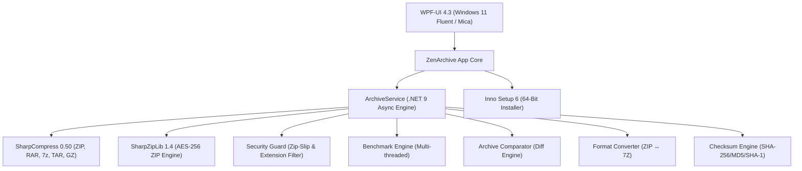

<div align="center">


# ZenArchive

### 🏆 The Modern, Open-Source Alternative to WinRAR & 7-Zip

**Next-generation archive manager built for Windows 11 — .NET 9, Mica Glassmorphism, AES-256 Security & features no other archiver has.**

[](https://dotnet.microsoft.com/)
[](https://github.com/lepoco/wpfui)
[](LICENSE)
[](#-enterprise-security--defense-features)
[](https://github.com/Tabish955/ZenArchieve/releases)
[](https://github.com/Tabish955/ZenArchieve)

---

**[📥 Download Latest Release](https://github.com/Tabish955/ZenArchieve/releases)** · **[🐛 Report Bug](https://github.com/Tabish955/ZenArchieve/issues)** · **[💡 Request Feature](https://github.com/Tabish955/ZenArchieve/issues)**

</div>

---

## 🌟 Why ZenArchive?

For decades, archive management on Windows has been trapped in 1998: clunky Win32 dialogs, "Buy WinRAR" nag screens, no preview capability, vulnerability to path traversal exploits, and zero visual feedback.

**ZenArchive** reimagines archiving from the ground up — delivering the features that WinRAR and 7-Zip simply don't have:

| 🎨 **Stunning UI** | 🧠 **Smart Extract** | 🔍 **Archive Diff** | 📊 **Size Analyzer** |
|:---:|:---:|:---:|:---:|
| Native Windows 11 Mica, dark Fluent theme, micro-animations | Auto-prevents desktop clutter by detecting loose files | Compare two archives — find added/removed/modified files | Visual breakdown of space usage by folder & file type |

| 🔄 **Format Converter** | 🔐 **AES-256 Encryption** | 📋 **Checksum Verifier** | 🛡️ **Security Guard** |
|:---:|:---:|:---:|:---:|
| One-click ZIP ↔ 7Z conversion | Military-grade password protection with strength meter | SHA-256/MD5/SHA-1 for entire archive files | Zip-Slip & disguised extension attack neutralization |

---

## ⚔️ ZenArchive vs. Competitors

| Feature | **ZenArchive v2.0** | **WinRAR** | **7-Zip** | **PeaZip** |
| :--- | :---: | :---: | :---: | :---: |
| **User Interface** | ✅ Windows 11 Fluent / Mica | ❌ 1995 Win32 | ❌ Minimal Win32 | ⚠️ Custom Widget |
| **100% Free & Open Source** | ✅ **MIT License** | ❌ Paid / Nag | ✅ Free | ✅ Free |
| **Smart Extract (Clutter Prevention)** | ✅ **Automatic** | ❌ Manual | ❌ Manual | ⚠️ Semi |
| **🆕 Archive Comparison (Diff Tool)** | ✅ **Built-in** | ❌ No | ❌ No | ❌ No |
| **🆕 Size Analyzer (Visual Breakdown)** | ✅ **Built-in** | ❌ No | ❌ No | ❌ No |
| **🆕 One-Click Format Converter** | ✅ **ZIP ↔ 7Z** | ❌ No | ❌ Manual | ❌ No |
| **🆕 Checksum Verifier (SHA/MD5)** | ✅ **Built-in** | ❌ No | ❌ No | ❌ No |
| **In-Memory Image & Code Previews** | ✅ **Direct Stream** | ❌ Temp File | ❌ Temp File | ⚠️ Basic |
| **Executable Threat Shield** | ✅ **SHA-256 Guard** | ❌ Auto-runs | ❌ Auto-runs | ❌ No |
| **Disguised Extension Blocker** | ✅ **Active Warning** | ❌ Hidden | ❌ Hidden | ❌ No |
| **Zip-Slip Path Traversal Defense** | ✅ **Strict Sandbox** | ⚠️ CVE History | ⚠️ Varies | ⚠️ Varies |
| **Multi-Archive Batch Processing** | ✅ **Smart Queue** | ⚠️ Wizard | ❌ No | ⚠️ Clunky |
| **Hardware Benchmark Engine** | ✅ **ZenScore** | ⚠️ Basic | ⚠️ Legacy | ❌ No |
| **Adware / Nag Screen** | 🚫 **None** | ❌ Constant | 🚫 None | 🚫 None |

> **4 features marked 🆕 are exclusive to ZenArchive — no other archive manager has them.**

---

## 🚀 Feature Highlights

### 1. 🧠 Smart Extract (Clutter-Free Extraction)
Tired of extracting an archive and having 50 loose files scattered across your Desktop?
- **Loose File Detection**: Automatically creates a dedicated subfolder when multiple loose files exist at the archive root.
- **Single Folder Preservation**: If the archive already has a clean root folder structure, ZenArchive extracts directly — no annoying duplicate nesting.

### 2. 🔍 Archive Comparison (Diff Tool) — *EXCLUSIVE*
Compare any two archives side-by-side with a structured diff report:
- **Added**: Files present in Archive B but not in A
- **Removed**: Files present in Archive A but not in B
- **Modified**: Files with different sizes or timestamps
- **Identical**: Files that match exactly

### 3. 📊 Size Analyzer — *EXCLUSIVE*
Visual breakdown showing which files and folders consume the most space:
- **By Folder**: Proportional bar chart showing folder sizes
- **By File Type**: Size distribution across extensions (.dll, .exe, .json, etc.)
- **Largest Files**: Top 10 space consumers with percentage contribution

### 4. 🔄 One-Click Format Converter — *EXCLUSIVE*
Convert between archive formats with a single click:
- **ZIP → 7Z**: Click Convert on any loaded ZIP to create a 7Z version
- **7Z/RAR/TAR → ZIP**: Convert any format to universal ZIP
- Extracts to temp, re-compresses in target format, then cleans up automatically

### 5. 📋 Checksum Verifier — *EXCLUSIVE*
Calculate and verify cryptographic hashes for the entire archive file:
- **SHA-256**, **MD5**, and **SHA-1** calculated simultaneously
- One-click copy to clipboard
- Verify integrity against expected hashes from download pages

### 6. 👁️ In-Archive Quick Look Preview & Inspector
Click any entry in the archive to preview it directly in memory:
- **Images**: Instant high-DPI rendering for PNG, JPG, BMP, WebP, ICO
- **Text & Code**: Formatted read-only viewer for .txt, .json, .xml, .cs, .py, .md, .sql
- **Safety Shield**: Executables (.exe, .bat, .dll, .ps1) are blocked from preview execution — SHA-256 hash displayed for virus verification

### 7. 🛡️ Enterprise Security & Defense Features
- **Zip-Slip Neutralization**: Strips path traversal attacks (`../../evil.exe`) — entries are strictly sandboxed within the target extraction directory
- **Disguised Double-Extension Detection**: Flags `invoice.pdf.exe` or `photo.jpg.scr` with high-contrast warning badges
- **Integrity Audit ("Test Archive")**: Decompresses every entry in-memory, verifies CRC checksums, and produces a diagnostic health report

### 8. 🔐 AES-256 Password Encryption
- Compress to `.zip` or `.7z` with **AES-256 bit encryption**
- Choose between **Store**, **Fast**, **Normal**, or **Maximum** compression
- Live **Password Strength Meter** with entropy feedback
- Support for encrypted filenames in `.7z` format

### 9. 📦 Batch Processing Queue
- Drag and drop multiple archives to summon the batch queue
- **Smart Extract All**, **Convert All to ZIP**, or **Convert All to 7Z**
- Dual-progress bars: individual file + overall queue progress

### 10. ⏱️ Hardware Compression Benchmark
- Multi-threaded in-memory stress workload across all CPU cores
- Measures compression and decompression throughput in MB/s
- Awards an official **ZenScore** rating tier

---

## 💻 Command-Line Interface (CLI)

ZenArchive supports full CLI automation and shell integration:

| Command | Description |
| :--- | :--- |
| `ZenArchive.exe "C:\Path\To\file.zip"` | Opens and inspects the specified archive |
| `ZenArchive.exe -extract-here "C:\Path\To\file.zip"` | Extracts directly into the archive's parent folder |
| `ZenArchive.exe -smart-extract "C:\Path\To\file.zip"` | Clutter-free Smart Extract (auto-creates subfolder if needed) |
| `ZenArchive.exe -extract-files "C:\Path\To\file.zip"` | Prompts for destination folder, then extracts |
| `ZenArchive.exe -compress "C:\Path\To\Files"` | Opens Create Archive modal with source pre-populated |

---

## 🏗️ Architecture & Technology Stack



| Component | Technology |
| :--- | :--- |
| **Framework** | .NET 9.0 (`net9.0-windows`) |
| **UI & Design System** | [WPF-UI](https://github.com/lepoco/wpfui) — Fluent Design, Windows 11 Mica backdrop |
| **Archive Parsing** | [SharpCompress](https://github.com/adamhathcock/sharpcompress) — High-performance async streaming |
| **AES-256 Engine** | [SharpZipLib](https://github.com/icsharpcode/SharpZipLib) — Native AES-256 encryption |
| **Installer** | [Inno Setup 6](https://jrsoftware.org/isinfo.php) — Modern 64-bit installer |

---

## 📦 Installation

### Option 1: Installer (Recommended)
Download the latest installer from [**Releases**](https://github.com/Tabish955/ZenArchieve/releases):
> **`ZenArchive_Setup_v2.0.exe`**

The installer provides:
- ✅ 64-bit installation to `C:\Program Files\ZenArchive`
- ✅ File associations for `.zip`, `.7z`, `.rar`, `.tar`, `.gz`
- ✅ Clean Explorer right-click context menu (with app icon):
  - **Extract Here**
  - **Extract Files...**
  - **Extract to \<ArchiveName\>\\**
  - **Add to ZenArchive...**
- ✅ Start Menu & Desktop shortcuts
- ✅ Clean Control Panel uninstaller

### Option 2: Build from Source

**Prerequisites:**
- [.NET 9.0 SDK](https://dotnet.microsoft.com/download/dotnet/9.0) or higher
- Windows 10 (1809+) or Windows 11 (64-bit)
- Optional: [Inno Setup 6](https://jrsoftware.org/isdl.php) (for building the installer)

```powershell
# Clone repository
git clone https://github.com/Tabish955/ZenArchieve.git
cd ZenArchieve

# Build in Release configuration
dotnet build "Archieve App/Archieve App.csproj" -c Release

# Run ZenArchive
dotnet run --project "Archieve App/Archieve App.csproj"
```

**Build the Installer:**
```powershell
powershell -ExecutionPolicy Bypass -File "Archieve App/installer/build_installer.ps1"
```

---

## ⌨️ Keyboard Shortcuts

| Shortcut / Action | Function |
| :--- | :--- |
| `Ctrl + O` / Toolbar Open | Browse and inspect an archive |
| `Ctrl + N` / Toolbar New | Open Create Archive modal |
| `Drag & Drop (1 archive)` | Instantly open and inspect |
| `Drag & Drop (multiple)` | Summon Batch Processing Queue |
| `Drag & Drop (files/folders)` | Open Create Archive with files pre-selected |
| `Search Box` | Real-time filter by filename, extension, or path |
| `Click DataGrid row` | Expand Quick Look Preview / Inspector |
| `Esc` | Close any active modal |

---

## 🤝 Contributing

Contributions are welcome! Here's how you can help:

1. **Fork** the repository
2. **Create** a feature branch (`git checkout -b feature/amazing-feature`)
3. **Commit** your changes (`git commit -m 'Add amazing feature'`)
4. **Push** to the branch (`git push origin feature/amazing-feature`)
5. **Open** a Pull Request

### Areas Where You Can Contribute:
- 🌐 **Internationalization**: Help translate ZenArchive to other languages
- 🎨 **Themes**: Add light mode or custom accent color themes
- 📦 **Format Support**: Extend support for additional archive formats
- 🧪 **Testing**: Help test on different Windows versions and edge cases
- 📖 **Documentation**: Improve docs, add tutorials, record demo videos

---

## 📄 License

ZenArchive is open-source software released under the **[MIT License](LICENSE)**.

You are free to use, modify, distribute, and commercialize this software with no restrictions. No nag screens, no trial periods, no hidden costs. **Free forever.**

---

## 🙏 Acknowledgments

- Built with ❤️ using [.NET 9](https://dotnet.microsoft.com/) by Microsoft
- UI powered by [WPF-UI](https://github.com/lepoco/wpfui) by Lepoco
- Compression powered by [SharpCompress](https://github.com/adamhathcock/sharpcompress) and [SharpZipLib](https://github.com/icsharpcode/SharpZipLib)
- Packaging powered by [Inno Setup 6](https://jrsoftware.org/isinfo.php) by Jordan Russell

---

<div align="center">

**⭐ If ZenArchive has been useful to you, please consider giving it a star on GitHub! ⭐**

Made with ❤️ by [Tabish Ahmed](https://github.com/Tabish955)

</div>
